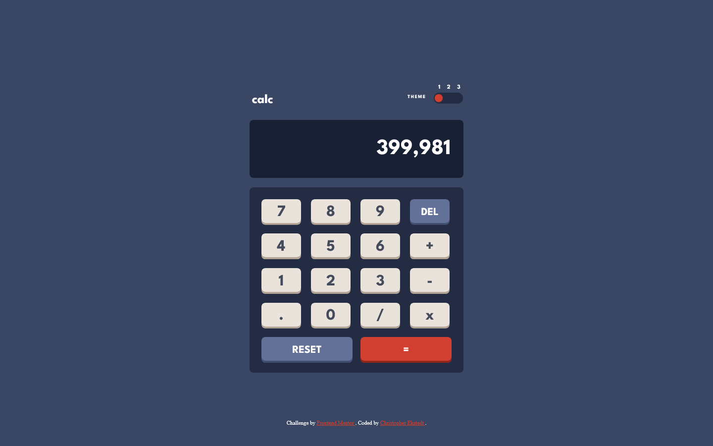
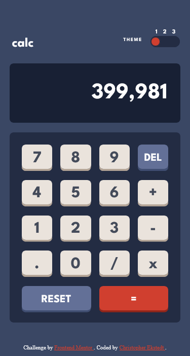

# Frontend Mentor - Calculator app solution

This is a solution to the [Calculator app challenge on Frontend Mentor](https://www.frontendmentor.io/challenges/calculator-app-9lteq5N29). Frontend Mentor challenges help you improve your coding skills by building realistic projects.

## Table of contents

- [Overview](#overview)
  - [The challenge](#the-challenge)
  - [Screenshot](#screenshot)
  - [Links](#links)
- [My process](#my-process)
  - [Built with](#built-with)
- [Author](#author)

## Overview

### The challenge

- Build out the project to the designs provided

### Screenshot

### Links

- Solution URL: [Github](https://github.com/cekstedt/FEM-Calculator-App)
- Live Site URL: [Netlify](https://vermillion-druid-900d9f.netlify.app/)

## My process

### Built with

- Test Driven Development (Jest)
- Vite

## Author

- Frontend Mentor - [@cekstedt](https://www.frontendmentor.io/profile/cekstedt)
